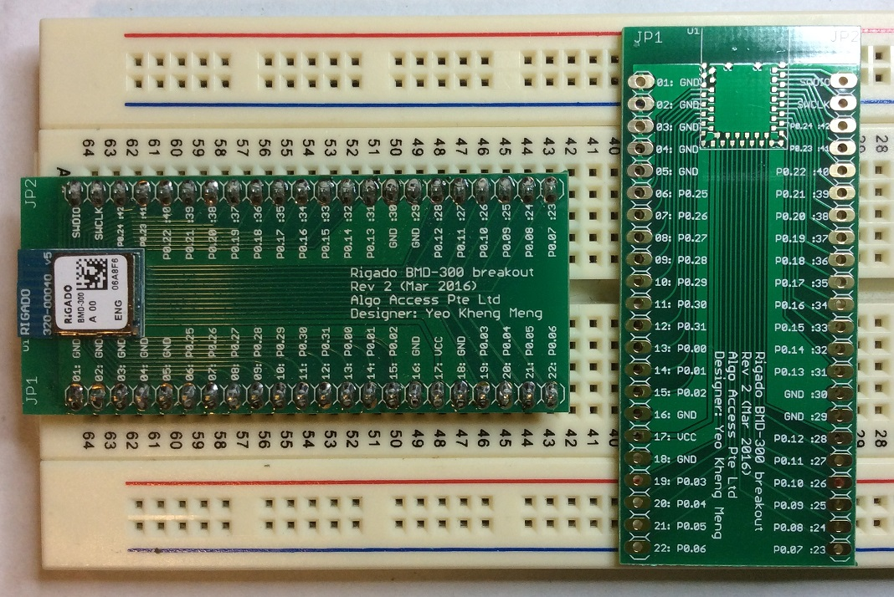

# pcb-breakout-bmd300

Pin breakout of the Rigado BMD-300 module based on Nordic NRF52 to through-hole pin headers for prototyping.

##PCB Design software and addons used

1. Eagle 7.5.0 standard but freeware should work too
2. BMD-300 library by [Rigado](https://www.rigado.com/product/bmd-300/) (in repo as BMD-300.lbr)

##Images

This is the Rev 1 version where there is an error in Rigado's library between Pin 30 and 31 as raised by this issue [here](https://github.com/algoaccess/pcb-breakout-bmd300/issues/1). I have updated to the lastest library by Rigado in Rev 2.

##Schematic drawings
Images are exported from Eagle at 600dpi.

##Parts required

The BMD-300 is still currently sampling and can be requested direct from the manufacturer [Rigado](https://www.rigado.com/product/bmd-300/)
